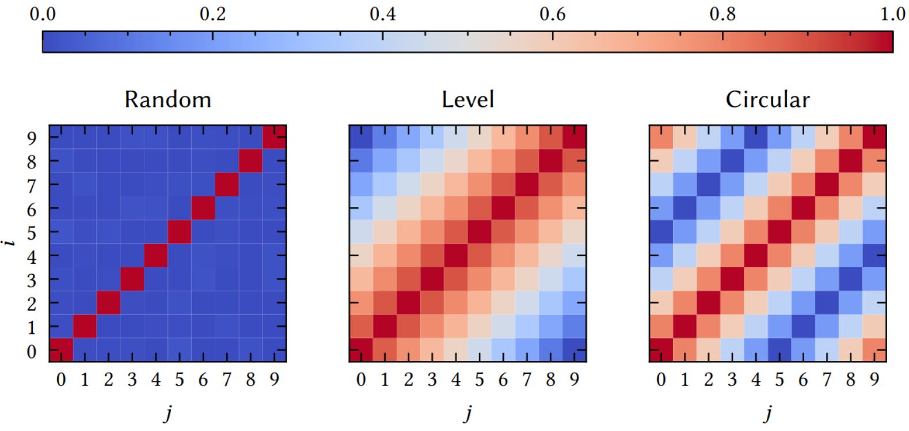

Getting started
===============

In this tutorial, we demonstrate some basic features of Torchhd. We show how the library makes it easy to represent and manipulate information in hyperspace through the fictitious example in the following table:

.. list-table::
   :widths: 10 10 10 10
   :align: center
   :header-rows: 1

   * - Record
     - Fruit
     - Weight
     - Season
   * - :math:`r_1`
     - apple
     - 149.0
     - fall
   * - :math:`r_2`
     - lemon
     - 70.5
     - winter
   * - :math:`r_3`
     - mango
     - 173.2
     - summer

Basis-hypervectors
------------------

The first step to encode these records is to define the basis-hypervectors for each information set. Since the nature of these information sets is different, so are the basis-hypervector sets used to encode them. We start by defining the number of dimensions of the hyperspace and then using the methods from the :ref:`functional` module to create the basis-hypervectors with the apropriate correlation profile:

.. code-block:: python

	import torchhd

	d = 10000 # dimensions
	fruits = torchhd.random(3, d)
	weights = torchhd.level(10, d)
	seasons = torchhd.circular(4, d)
	var = torchhd.random(3, d)

which creates hypervectors for the 3 fruit types, 10 weight levels, 4 seasons and the 3 variables. The figure below illustrates the distance between the pairs of hypervectors in each set:

Similar behavior can be achieved using the classes in the :ref:`embeddings` module. The classes add convenience methods for mapping values to hypervectors. For example, to map the interval :math:`[0, 200]` to the ten weight hypervectors the :ref:`functional<functional>` version above requires an explicit mapping to an index:

.. code-block:: python

	import torch

	weight = torch.tensor([149.0])
	# explicit mapping of the fruit weight to an index
	w_i = torchhd.value_to_index(weight, 0, 200, 10)
	weights[w_i]  # select representation of 149

whereas the :ref:`embeddings<embeddings>` have this common behavior built-in:

.. code-block:: python

	from torchhd import embeddings

	W_emb = embeddings.Level(10, d, low=0, high=200)
	# select representation of 149
	W_emb(weight)  # same result as weights[w_i]

Operations
----------

Once the basis-hypervectors are defined, we can use the MAP operations from :ref:`functional` to encode more complex objects by combining basis-hypervectors. The hypervector for record :math:`r_1` can be created as follows:

.. code-block:: python

	f = torchhd.bind(var[0], fruits[0])   # fruit = apple
	w = torchhd.bind(var[1], weights[w_i]) # weight = 149
	s = torchhd.bind(var[2], seasons[3])   # season = fall
	r1 = torchhd.bundle(torchhd.bundle(f, w), s)

which is equivalent to using the following shortened syntax:

.. code-block:: python
	
	r1 = var[0] * fruits[0] + var[1] * weights[w_i] + var[2] * seasons[3]

Data Structures
---------------

Alternatively, we can use one of the commonly used encodings provided in the :ref:`functional` module. Using these, record :math:`r_1` can be encoded as follows:

.. code-block:: python

	# combine values in one tensor of shape (3, d)
	values = torch.stack([fruits[0], weights[w_i], seasons[3]])
	r1 = torchhd.hash_table(var, values)

The :ref:`structures` module contains the same encoding patterns in addition to binary trees and finite state automata, but provides them as data structures. This module provides class-based implementations of HDC data structures. Using the hash table class, record :math:`r_1` can be represented as follows:

.. code-block:: python 

	from torchhd import structures

	r1 = structures.HashTable(d)  # r1 = 0
	r1.add(var[0], fruits[0])     # r1 + var[0] * fruits[0]
	r1.add(var[1], weights[w_i])   # r1 + var[1] * weights[w_i]
	r1.add(var[2], seasons[3])     # r1 + var[2] * seasons[3]
	# query the hash table by key:
	fruit = r1.get(var[0])   # r1 * var[0]
	weight = r1.get(var[1])  # r1 * var[1]
	season = r1.get(var[2])  # r1 * var[2]